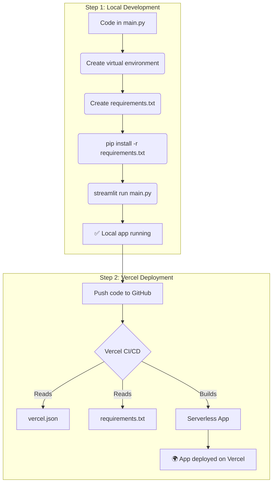

# EF1-EF2 Migration Chatbot

**Dynatrace auto-converters for JMX from EF1 to EF2**

---

## Project Overview

This project provides a chatbot and automation tools to help migrate JMX configurations from Dynatrace EF1 to EF2. It includes a Streamlit application for local use and is ready for deployment on Vercel.

### Features

- Automated conversion of JMX configurations from EF1 to EF2.
- User-friendly Streamlit web interface.
- Ready-to-deploy on Vercel with minimal configuration.
- Supports local development with virtual environments.

---

## Quick Start (English)

### 1. Set Up Local Environment

Create and activate a Python virtual environment:
```bash
python3 -m venv .venv
source .venv/bin/activate
```

### 2. Install Dependencies

Install required Python packages:
```bash
pip install -r requirements.txt
```

### 3. Run the Application

Start the Streamlit app:
```bash
streamlit run main.py
```
The app will be available at [http://localhost:8501](http://localhost:8501).

---

## Deployment on Vercel

1. Create a `vercel.json` file at the project root:
    ```json
    {
      "builds": [
        {
          "src": "main.py",
          "use": "@vercel/python"
        }
      ],
      "routes": [
        {
          "src": "/(.*)",
          "dest": "main.py"
        }
      ]
    }
    ```
2. Deploy using Vercel CLI or GitHub integration:
    - **Vercel CLI:**  
      Install CLI (`npm install -g vercel`), login (`vercel login`), and deploy (`vercel`).
    - **GitHub Integration (Recommended):**  
      Push your code to GitHub and connect the repo to Vercel. Deployments are automatic on push.

---

## Workflow Diagram



---

## Contact

For questions or support, please open an issue or contact the maintainer.

---

# Plan de Développement et Déploiement (Français)

Ce document décrit les étapes pour configurer l'environnement de développement local, exécuter l'application Streamlit et la préparer pour un déploiement sur Vercel.

## Partie 1 : Environnement Local et Exécution

**Objectif :** Lancer votre application Streamlit en local.

### Étape 1 : Créer un environnement virtuel

Pour isoler les dépendances de votre projet, il est recommandé d'utiliser un environnement virtuel.

*   **Action :** Ouvrez un terminal et exécutez les commandes suivantes :
    ```bash
    # Créer l'environnement virtuel (nommé .venv)
    python3 -m venv .venv

    # Activer l'environnement
    source .venv/bin/activate
    ```

### Étape 2 : Créer le fichier `requirements.txt`

Ce fichier listera toutes les dépendances Python nécessaires à votre projet.

*   **Action :** Créer un fichier nommé `requirements.txt` avec le contenu suivant :
    ```
    streamlit
    pyyaml
    groq
    ```

### Étape 3 : Installer les dépendances

Cette commande lira le fichier `requirements.txt` et installera les bibliothèques nécessaires.

*   **Action :** Dans le terminal où l'environnement virtuel est activé, exécutez :
    ```bash
    pip install -r requirements.txt
    ```

### Étape 4 : Lancer l'application Streamlit

Une fois les dépendances installées, vous pouvez démarrer votre application.

*   **Action :** Exécutez la commande suivante :
    ```bash
    streamlit run main.py
    ```
    Votre application devrait être accessible dans votre navigateur à une adresse locale (généralement `http://localhost:8501`).

---

## Partie 2 : Plan de Déploiement sur Vercel

**Objectif :** Configurer le projet pour un déploiement simple et automatisé sur la plateforme Vercel.

### Étape 1 : Créer le fichier de configuration `vercel.json`

Ce fichier indique à Vercel d'utiliser l'environnement Python, d'installer les dépendances de `requirements.txt` et de diriger les requêtes entrantes vers votre script `main.py`.

*   **Action :** Créer un fichier nommé `vercel.json` à la racine de votre projet avec le contenu suivant :
    ```json
    {
      "builds": [
        {
          "src": "main.py",
          "use": "@vercel/python"
        }
      ],
      "routes": [
        {
          "src": "/(.*)",
          "dest": "main.py"
        }
      ]
    }
    ```

### Étape 2 : Processus de déploiement

Vous avez deux options principales pour déployer sur Vercel :

1.  **Via le Vercel CLI :**
    *   Installez le Vercel CLI (`npm install -g vercel`).
    *   Connectez-vous à votre compte (`vercel login`).
    *   Lancez le déploiement depuis la racine de votre projet (`vercel`).

2.  **Via l'intégration GitHub (Recommandé) :**
    *   Poussez votre code (incluant `main.py`, `requirements.txt`, et `vercel.json`) sur un dépôt GitHub.
    *   Connectez ce dépôt à votre compte Vercel.
    *   Vercel déploiera automatiquement chaque nouvelle modification poussée sur votre branche principale.

---

## Diagramme du Flux de Travail

```mermaid
graph TD
    subgraph "Étape 1: Développement Local"
        A[Code dans main.py] --> B(Créer un environnement virtuel);
        B --> C(Créer requirements.txt);
        C --> D(pip install -r requirements.txt);
        D --> E(streamlit run main.py);
        E --> F[✅ App locale fonctionnelle];
    end

    subgraph "Étape 2: Déploiement Vercel"
        G[Pousser le code sur GitHub] --> H{CI/CD de Vercel};
        H -- Lit --> I[vercel.json];
        H -- Lit --> J[requirements.txt];
        H -- Construit --> K[Application Serverless];
        K --> L[🌍 App déployée sur Vercel];
    end

    F --> G;
