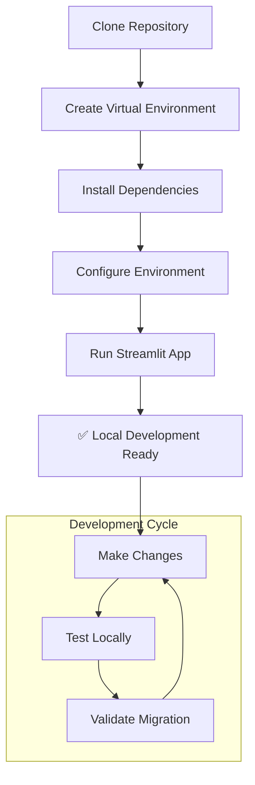
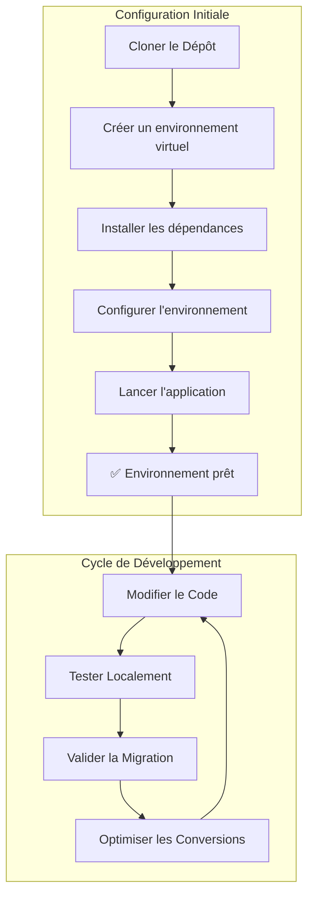

# EF1-EF2 Migration Chatbot

**Dynatrace auto-converters for JMX from EF1 to EF2**

---

## Project Overview

This project provides a chatbot and automation tools to help migrate JMX configurations from Dynatrace EF1 to EF2. It includes a Streamlit web application for interactive migration assistance.

### Features

- Automated conversion of JMX configurations from EF1 to EF2
- User-friendly Streamlit web interface
- Interactive chatbot for migration guidance
- Support for local development with virtual environments
- YAML configuration processing
- AI-powered assistance for complex migration scenarios

---

## Quick Start (English)

### 1. Set Up Local Environment

Create and activate a Python virtual environment:
```bash
python3 -m venv .venv
source .venv/bin/activate
```

### 2. Install Dependencies

Install required Python packages:
```bash
pip install -r requirements.txt
```

### 3. Run the Application

Start the Streamlit app:
```bash
streamlit run main.py
```
The app will be available at [http://localhost:8501](http://localhost:8501).

---

## Dependencies

The project uses the following Python libraries:
- **Streamlit**: For the web interface
- **PyYAML**: For YAML configuration processing
- **Groq**: For AI-powered assistance

---

## Usage

1. Launch the application using the commands above
2. Upload your EF1 JMX configuration files
3. Use the chatbot interface to get migration guidance
4. Download the converted EF2 configuration files
5. Review and implement the suggested changes

---

## Local Development Workflow



---

## Contact

For questions or support, please open an issue or contact the maintainer.

---

# Guide de Développement (Français)

Ce document décrit les étapes pour configurer l'environnement de développement local et exécuter l'application Streamlit.

## Configuration de l'Environnement Local

**Objectif :** Lancer votre application Streamlit en local pour la migration EF1 vers EF2.

### Étape 1 : Créer un environnement virtuel

Pour isoler les dépendances de votre projet, il est recommandé d'utiliser un environnement virtuel.

**Action :** Ouvrez un terminal et exécutez les commandes suivantes :
```bash
# Créer l'environnement virtuel (nommé .venv)
python3 -m venv .venv

# Activer l'environnement
source .venv/bin/activate
```

### Étape 2 : Vérifier le fichier `requirements.txt`

Ce fichier liste toutes les dépendances Python nécessaires au projet :
```
streamlit
pyyaml
groq
```

### Étape 3 : Installer les dépendances

Cette commande lira le fichier `requirements.txt` et installera les bibliothèques nécessaires.

**Action :** Dans le terminal où l'environnement virtuel est activé, exécutez :
```bash
pip install -r requirements.txt
```

### Étape 4 : Lancer l'application Streamlit

Une fois les dépendances installées, vous pouvez démarrer votre application.

**Action :** Exécutez la commande suivante :
```bash
streamlit run main.py
```
Votre application sera accessible dans votre navigateur à l'adresse `http://localhost:8501`.

---

## Flux de Travail de Développement



---

## Fonctionnalités Principales

- **Interface Web Intuitive** : Interface Streamlit pour une utilisation facile
- **Conversion Automatique** : Transformation automatique des configurations JMX
- **Assistant IA** : Aide intelligente pour les cas de migration complexes
- **Support YAML** : Traitement des fichiers de configuration YAML
- **Validation** : Vérification de la validité des conversions

---

## Structure du Projet

```
EF1-EF2-Migration-Chatbot/
├── main.py                 # Application Streamlit principale
├── requirements.txt        # Dépendances Python
└── README.md              # Documentation du projet
