# EF1-EF2-Migration-Chatbot

Dynatrance auto-converters for JMX from EF1 to EF2

# Plan de Développement et Déploiement

Ce document décrit les étapes pour configurer l'environnement de développement local, exécuter l'application Streamlit et la préparer pour un déploiement sur Vercel.

## Partie 1 : Environnement Local et Exécution

**Objectif :** Lancer votre application Streamlit en local.

### Étape 1 : Créer un environnement virtuel
Pour isoler les dépendances de votre projet, il est recommandé d'utiliser un environnement virtuel.

*   **Action :** Ouvrez un terminal et exécutez les commandes suivantes :
    ```bash
    # Créer l'environnement virtuel (nommé .venv)
    python3 -m venv .venv

    # Activer l'environnement
    source .venv/bin/activate
    ```

### Étape 2 : Créer le fichier `requirements.txt`
Ce fichier listera toutes les dépendances Python nécessaires à votre projet.

*   **Action :** Créer un fichier nommé `requirements.txt` avec le contenu suivant :
    ```
    streamlit
    pyyaml
    groq
    ```

### Étape 3 : Installer les dépendances
Cette commande lira le fichier `requirements.txt` et installera les bibliothèques nécessaires.

*   **Action :** Dans le terminal où l'environnement virtuel est activé, exécutez :
    ```bash
    pip install -r requirements.txt
    ```

### Étape 4 : Lancer l'application Streamlit
Une fois les dépendances installées, vous pouvez démarrer votre application.

*   **Action :** Exécutez la commande suivante :
    ```bash
    streamlit run main.py
    ```
    Votre application devrait être accessible dans votre navigateur à une adresse locale (généralement `http://localhost:8501`).

---

## Partie 2 : Plan de Déploiement sur Vercel

**Objectif :** Configurer le projet pour un déploiement simple et automatisé sur la plateforme Vercel.

### Étape 1 : Créer le fichier de configuration `vercel.json`
Ce fichier indique à Vercel d'utiliser l'environnement Python, d'installer les dépendances de `requirements.txt` et de diriger les requêtes entrantes vers votre script `main.py`.

*   **Action :** Créer un fichier nommé `vercel.json` à la racine de votre projet avec le contenu suivant :
    ```json
    {
      "builds": [
        {
          "src": "main.py",
          "use": "@vercel/python"
        }
      ],
      "routes": [
        {
          "src": "/(.*)",
          "dest": "main.py"
        }
      ]
    }
    ```

### Étape 2 : Processus de déploiement
Vous avez deux options principales pour déployer sur Vercel :

1.  **Via le Vercel CLI :**
    *   Installez le Vercel CLI (`npm install -g vercel`).
    *   Connectez-vous à votre compte (`vercel login`).
    *   Lancez le déploiement depuis la racine de votre projet (`vercel`).

2.  **Via l'intégration GitHub (Recommandé) :**
    *   Poussez votre code (incluant `main.py`, `requirements.txt`, et `vercel.json`) sur un dépôt GitHub.
    *   Connectez ce dépôt à votre compte Vercel.
    *   Vercel déploiera automatiquement chaque nouvelle modification poussée sur votre branche principale.

---

## Diagramme du Flux de Travail

```mermaid
graph TD
    subgraph "Étape 1: Développement Local"
        A[Code dans main.py] --> B(Créer un environnement virtuel);
        B --> C(Créer requirements.txt);
        C --> D(pip install -r requirements.txt);
        D --> E(streamlit run main.py);
        E --> F[✅ App locale fonctionnelle];
    end

    subgraph "Étape 2: Déploiement Vercel"
        G[Pousser le code sur GitHub] --> H{CI/CD de Vercel};
        H -- Lit --> I[vercel.json];
        H -- Lit --> J[requirements.txt];
        H -- Construit --> K[Application Serverless];
        K --> L[🌍 App déployée sur Vercel];
    end

    F --> G;
```


